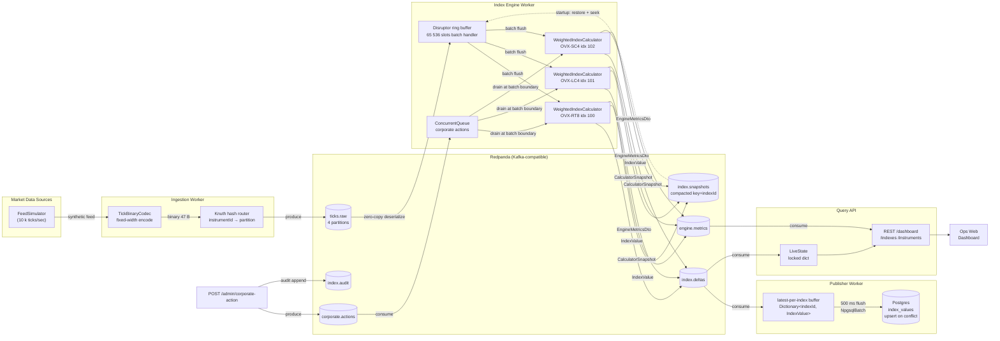
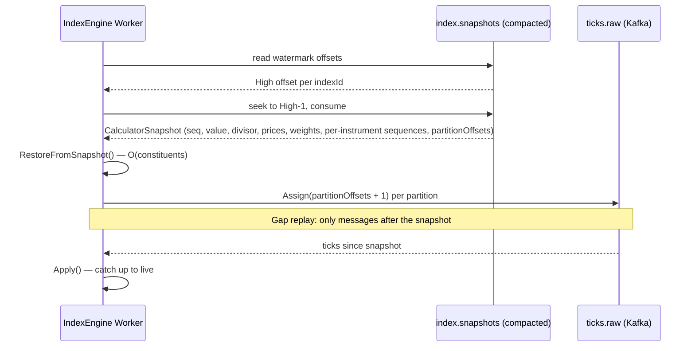
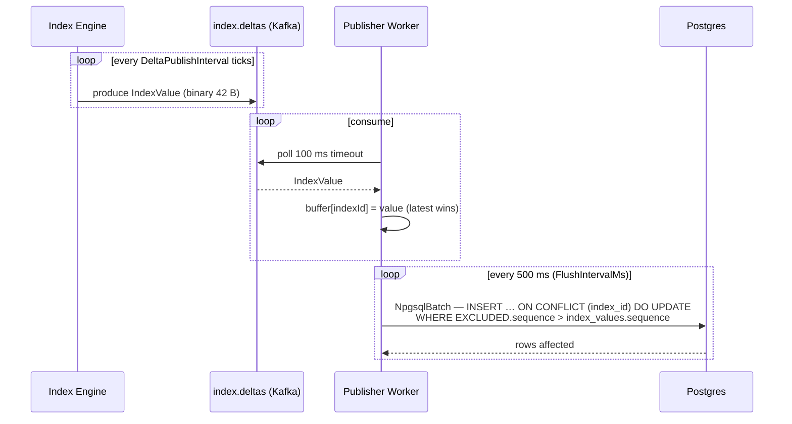
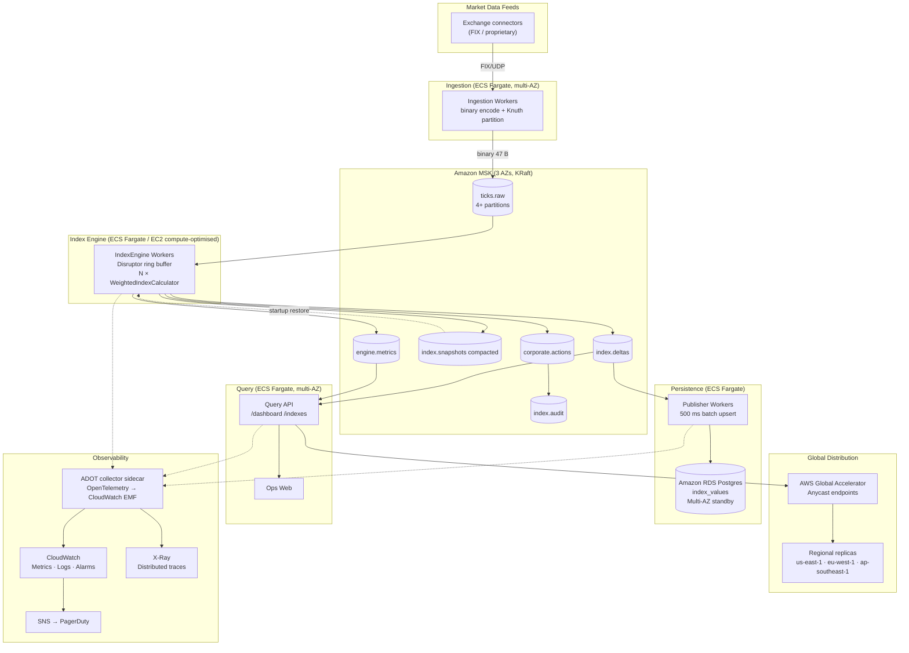

# Opticverge Real-Time Index Engineering Demo

Ultra-low-latency index engine in C# — built as a discussion platform for a Technical Lead interview.  
The design separates two lanes deliberately:

- **Hot path** — synthetic exchange ticks → partition routing → preallocated Disruptor ring buffer → O(1) incremental weighted index calculation.
- **Event lane** — Redpanda/Kafka topics for durable fan-out, replay, downstream consumers, Postgres persistence, and operational visibility.

---

## Prerequisites

| Requirement | Version | Notes |
|---|---|---|
| [.NET SDK](https://dotnet.microsoft.com/download) | 10.0+ | `dotnet --version` to verify |
| [Docker Desktop](https://www.docker.com/products/docker-desktop/) | 24.0+ | Runs Redpanda and Postgres containers |
| .NET Aspire workload | 13.x | `dotnet workload install aspire` |
| CPU | x64 | SIMD path uses AVX2; scalar fallback is automatic |

> Docker must be running before you start the AppHost. Aspire provisions Redpanda, Postgres, Redpanda Console, Kafka UI, and pgAdmin automatically.

---

## Run

```powershell
dotnet run --project Opticverge.Index.AppHost\Opticverge.Index.AppHost.csproj
```

Aspire starts all services and opens the Aspire dashboard. Redpanda Console, Kafka UI, and pgAdmin are linked from the dashboard resource list.

For a dashboard-only local check without Docker:

```powershell
dotnet run --project Opticverge.Index.Ops.Web\Opticverge.Index.Ops.Web.csproj --urls http://localhost:5080
```

## Verify

```powershell
dotnet build Opticverge.Index.sln
dotnet test  Opticverge.Index.sln --no-build
dotnet run   --project Opticverge.Index.Benchmarks\Opticverge.Index.Benchmarks.csproj -c Release
```

The Docker-backed AppHost integration test is skipped by default so the normal test loop stays fast and fully deterministic.

---

## System Design

> Defaults in the diagrams below (10 k ticks/sec feed, 1 024-tick snapshot interval) are the Aspire AppHost configuration; the in-code defaults differ (100 k ticks/sec and 16 384 ticks respectively).

### High-level data flow



### State recovery (startup sequence)



### Postgres persistence (CQRS write side)



---

## Design Decisions & Tradeoffs

### 1 — Disruptor ring buffer over `Channel<T>` / `BlockingCollection`

**Decision:** Lmax Disruptor pattern via [Disruptor.NET](https://github.com/disruptor-net/Disruptor-Net).

| | Disruptor | `Channel<T>` | `BlockingCollection` |
|---|---|---|---|
| Allocation on hot path | None (pre-sized slots) | Allocation per enqueue | Allocation per enqueue |
| Batch handler | First-class API | Polling needed | Not built-in |
| P99 latency (in-process) | ~400 ns | ~2–5 µs | ~10–50 µs |
| Wait strategy | Yielding / busy-spin | Configurable | Blocking only |

**Why it matters:** the engine must sustain 10 k ticks/sec with sub-millisecond publish latency. The Disruptor's ring buffer is power-of-two sized so the sequence % capacity is a bitwise AND. All event slots are pre-allocated; the consumer claims a slot range, processes it, and advances its sequence. No heap allocation on the critical path.

**Tradeoff:** harder to reason about (sequence barriers, wait strategies, event slot reuse); single-consumer constraint means all calculators share one thread — acceptable because N (number of indexes) is small.

---

### 2 — Incremental O(1) index calculation over full recompute

**Decision:** `value += newContribution - oldContribution` (delta contribution).

```
newValueE8 = _valueE8 - ContributionE8(oldPrice, weight) + ContributionE8(newPrice, weight)
```

**Why:** At 10 k ticks/sec across N indexes, full recompute is O(constituents × indexes) = O(8 × 3) = 24 arithmetic ops vs O(2) for the incremental path. The difference is small at demo scale but at production scale (500+ constituents, 10+ indexes, 1 M ticks/sec) the CPU budget gap becomes the deciding constraint.

**Tradeoff:** accumulated floating-point rounding over millions of ticks. Mitigated by using scaled 64-bit integers (`long`, 8 decimal places) for all intermediate values; the `Divisor` alone is `double` because it holds the continuously adjusted denominator.

---

### 3 — Index divisor pattern for corporate action continuity

**Decision:** When weight/constituency changes, adjust the divisor so `newValue / newDivisor == oldValue / oldDivisor`.

```
newDivisor = newValueE8 * oldDivisor / oldValueE8
```

**Why:** Industry standard (S&P, FTSE Russell, MSCI all use divisor adjustment). Without it, every rebalance creates a visible discontinuity in the time series — which breaks backtesting, charting, and any downstream total-return calculation.

**Tradeoff:** the divisor drifts very slowly over time. The engine snapshots it alongside the value, so recovery restores continuity exactly.

**Alternatives considered:**
- *Level reset on rebalance* — simple but breaks historical continuity.
- *Price adjustment factor* — used in single-stock back-adjustment; not applicable to weighted index baskets.

---

### 4 — Knuth multiplicative hash for partition routing

**Decision:** `(uint)instrumentId.Value * 2_654_435_761u` (golden ratio multiplier) modulo partition count.

**Why:**
- Zero allocation: pure integer arithmetic, no string/byte conversion.
- Deterministic and stable: same instrument always maps to the same partition → ordering guarantee within a partition.
- Well-distributed: Knuth's multiplicative hashing avoids the clustering that simple modular arithmetic causes with sequential integer IDs.

**Alternatives considered:**
- *MD5/SHA* — allocates per call, 10–100× slower on the hot path.
- *`instrumentId % partitions`* — poor distribution with sequential IDs (most traffic goes to low-numbered partitions).
- *Consistent hashing* — overkill for a fixed partition count; adds rebalance complexity for no benefit here.

---

### 5 — CQRS write stream: Kafka → batch upsert → Postgres

**Decision:** The engine writes to `index.deltas` (Kafka). A dedicated Publisher Worker consumes that topic, buffers the latest value per index in-memory, and flushes to Postgres every 500 ms via `NpgsqlBatch` with `ON CONFLICT DO UPDATE`.

**Why:** A direct DB write from the engine on every tick would:
- Introduce a ~1 ms Postgres round-trip into the hot path.
- Cap throughput at ~1 k writes/sec per connection (Postgres limit).
- Create a tight coupling between the compute and persistence tiers.

The CQRS approach decouples latency from durability. The engine publishes at nanosecond latency; the persistence worker is eventually consistent at ~500 ms lag — an acceptable tradeoff for a read-side materialization.

**The sequence guard** (`WHERE EXCLUDED.sequence > index_values.sequence`) prevents a redelivered stale Kafka offset from overwriting a newer value.

**Alternatives considered:**
- *Direct Npgsql write in engine* — kills throughput; engine must never block on I/O.
- *Event sourcing to Postgres (all deltas)* — unbounded table growth, complex querying; the requirement is "latest values only."
- *Redis for the write side* — fast but not as queryable; Postgres gives full SQL, JOINs, and compliance tooling.

---

### 6 — Compacted Kafka topic for state recovery

**Decision:** `index.snapshots` is a compacted topic (one key = one indexId). On startup, the engine reads the latest snapshot per index, seeks the tick consumer to the snapshot's per-partition offsets, and replays only the gap.

**Why:**
- Bounded RTO: startup cost = snapshot load (O(1) Kafka read) + gap replay (bounded by how long the engine was down × ingestion rate).
- Bounded RPO: last snapshot captured at each `DeltaPublishInterval` or on graceful shutdown.
- No external checkpoint store needed — Kafka compaction gives "latest value per key" natively.

**Tradeoff:** if the Kafka retention window is shorter than the gap, the engine falls back to initial state. Mitigated by writing a final snapshot on graceful shutdown.

**Alternatives considered:**
- *Full replay from offset 0* — O(all ticks ever); unacceptable if retention holds days of data.
- *Redis / external checkpoint* — additional infrastructure dependency; Kafka already provides the durability guarantee.
- *Database checkpoint table* — correct, but adds a synchronous write to the hot path on every interval.

---

### 7 — Server GC + `SustainedLowLatency`

**Decision:** `ServerGarbageCollection=true`, `GCLatencyMode.SustainedLowLatency`, `GarbageCollectionAdaptationMode=0`.

**Why:**
- Server GC allocates one heap per logical CPU core, reducing heap lock contention.
- `SustainedLowLatency` suppresses Gen 2 collections, keeping GC pauses under 1 ms vs the ~10–50 ms that a full Gen 2 collection can cause.
- `AdaptationMode=0` prevents the runtime from reverting the GC mode under allocation pressure.

**Tradeoff:** higher baseline memory consumption (separate heaps). Acceptable because the hot path allocates near-zero anyway; the benefit is insurance against stop-the-world pauses from upstream/downstream allocation.

---

### 8 — Zero-copy tick deserialization

**Decision:** Custom `IDeserializer<MarketTick>` reading directly from the librdkafka-owned span into a `MarketTick` struct via `Unsafe.ReadUnaligned`.

**Why:** The default Kafka `BytesDeserializer` copies the payload into a managed `byte[]` before you can inspect it — that's one heap allocation per message. At 10 k ticks/sec that is 10 k Gen 0 allocations/sec → more frequent minor GC pauses. The custom deserializer reads the fixed-width 47-byte frame directly from the native buffer with no copy.

**Tradeoff:** `Unsafe` code — maintainer must understand the invariants (little-endian layout, fixed field offsets). Mitigated by the `TickBinaryCodec` roundtrip test.

---

### 9 — Redpanda over Apache Kafka

**Decision:** [Redpanda](https://redpanda.com/) — Kafka-compatible, single binary, no ZooKeeper/KRaft ceremony.

**Why:** The same `Confluent.Kafka` client works without modification. Redpanda starts significantly faster in a Docker container (relevant for local dev and the Aspire AppHost startup time). Its thread-per-core architecture gives lower tail latency in single-node scenarios.

**Tradeoff:** not identical to the Kafka you would run in production. Any Kafka-specific admin API (ACLs, quota enforcement, MirrorMaker) would need retesting. Acceptable here because the demo is explicitly a discussion platform, not a production rollout.

**Alternatives considered:**
- *Apache Kafka* — production standard but slower local startup, ZooKeeper/KRaft overhead.
- *Redis Streams* — no partition-level ordering guarantee, no compaction, limited retention tooling.
- *NATS JetStream* — excellent for edge/IoT; less familiar to capital-markets engineers; ecosystem tooling (Schema Registry, Kafka Connect) does not apply.

---

### 10 — Multi-index on a single ring buffer

**Decision:** One `DisruptorIndexPipeline` holds N `WeightedIndexCalculator` instances. Each ring event is broadcast to all calculators; calculators that do not contain the instrument return immediately via a bounds-check + slot lookup (O(1)).

**Why:**
- A single consumer thread owns all calculator state — no cross-thread synchronization for the calculators.
- Cache locality: all calculator arrays fit comfortably in L2/L3 for N ≤ ~20 indexes.
- Simpler lifecycle: one pipeline to start, monitor, snapshot, and shut down.

**Tradeoff:** one slow calculator (e.g., one with many constituents) can delay the others. At production scale with 100+ indexes you would shard calculators across multiple pipelines. The current architecture makes that migration straightforward: instantiate multiple `DisruptorIndexPipeline` instances with disjoint index sets, each with its own consumer thread.

---

## AWS Well-Architected Alignment

### Service Level Objective

> **99.9% of index values are published within 40 ms of the triggering exchange event**, measured at the p99.9 percentile over a rolling 5-minute window.

The SLO is operationalised by the `index.end_to_end.latency` OpenTelemetry histogram (exchange `TimestampNanos` → calculation start, sampled once per batch; the calculator step itself is tracked separately by `index.calculation.duration`) and the `e2e_latency_p99` CloudWatch alarm defined in [`infra/alarms.tf`](infra/alarms.tf).

---

### Production AWS Architecture



---

### CloudWatch Alarms

Defined in [`infra/alarms.tf`](infra/alarms.tf). Example tfvars in [`infra/env/staging.tfvars`](infra/env/staging.tfvars).

```bash
cd infra
terraform init
terraform plan -var-file=env/staging.tfvars
terraform apply -var-file=env/staging.tfvars
```

| Alarm | Threshold | Severity | Rationale |
|---|---|---|---|
| `e2e-latency-p99-breach` | p99 > 40 ms | **Critical** | Direct SLO breach |
| `processing-latency-p99` | p99 > 5 ms | Warning | Leading SLO indicator |
| `consumer-lag-high` | lag > 10 000 msgs | **Critical** | Engine cannot keep pace with ingestion |
| `ring-buffer-depth-high` | depth > 32 768 (50%) | Warning | Buffer pressure before back-pressure |
| `sequence-gaps` | any in 5 min | Warning | Possible feed data loss |
| `duplicate-events-spike` | > 100 in 5 min | Warning | Consumer restart loop suspected |
| `calculation-failures` | any in 5 min | Warning | Tick rejected outside normal paths |
| `dropped-messages` | any in 1 min | **Critical** | Binary codec decode failure |
| `stale-tick-rate-high` | > 1% of messages | Warning | Feed ordering or clock skew |
| `publisher-lag-high` | lag > 5 000 msgs | Warning | Postgres falling behind write stream |
| `gen2-gc-rate` | any Gen 2 in 5 min | Warning | Allocation leak onto hot path |

---

### Well-Architected Pillar Coverage

#### Performance Efficiency

| Question | Answer |
|---|---|
| PERF 1 — right resources for workload? | Disruptor ring buffer for sub-millisecond in-process latency; MSK for durable partitioned fan-out; ECS Fargate / EC2 compute-optimised for the calculation tier depending on latency budget |
| PERF 2 — right compute model? | Mechanical sympathy: Server GC + SustainedLowLatency; yielding wait strategy; dedicated consumer thread with optional CPU affinity for <1 µs scheduling jitter |
| PERF 3 — right data stores? | Kafka compacted topic for O(1) snapshot recovery; Postgres for latest-state materialisation (upsert-only, no range queries); ElastiCache / DynamoDB for sub-millisecond query-side reads if needed |
| PERF 4 — network topology? | AWS Global Accelerator routes consumers to the nearest healthy regional endpoint; authoritative calculation in one region, index delta replication via MSK MirrorMaker 2 to regional brokers |
| PERF 5 — p99/p99.9 regression testing? | `LatencyHistogram` records p50/p95/p99/p99.9 nanos; BenchmarkDotNet suite guards against regressions on codec, routing, and index math; `e2e-latency-p99-breach` fires in staging on any regression |

#### Reliability

| Question | Answer |
|---|---|
| REL 3 — independently scalable tiers? | Ingestion, engine, publisher, and query API are separate ECS services; each scales independently on its own metric (consumer lag for engine, CPU for query API) |
| REL 4/5 — distributed failure modes? | Duplicate events: `MarkDuplicate()` per-instrument inside the Disruptor handler; stale/OOO ticks: `PriceNormalizer.IsStale()` rejects backward timestamps; sequence gaps: `MarkSequenceGap()` triggers alarm and optional replay |
| REL 7 — demand spikes? | ECS Service Auto Scaling on `consumer-lag` CloudWatch metric; MSK partition count sets the maximum parallelism ceiling |
| REL 10 — fault isolation? | Index families partitioned across calculator shards; a failed shard only affects its index family; MSK partition ownership isolates feed failures per-partition |
| REL 11 — node failure? | ECS replaces failed tasks automatically; on restart the engine loads the latest `CalculatorSnapshot` from the compacted topic and replays only the gap — no manual operator intervention |
| REL 12 — tested failure conditions? | Sequence gap injection, stale-tick injection, and deterministic replay tests exist in `FailureDrillTests`; chaos testing (kill ECS task, partition network) planned for staging |
| REL 13 — disaster recovery? | RPO = snapshot interval (default every 1 024 ticks consumed under the AppHost) + gap since last snapshot; RTO = container start time + snapshot load + gap replay; cross-region: MirrorMaker 2 replicates `index.snapshots` to DR region |

#### Operational Excellence

| KPI | Metric name | Alarm |
|---|---|---|
| Ingestion rate | `index.messages.in` | Consumer lag alarm |
| Processing p99 latency | `index.processing.latency.p99` | `processing-latency-p99` |
| End-to-end p99 | `index.end_to_end.latency.p99` | `e2e-latency-p99-breach` (SLO) |
| Sequence gap rate | `index.events.sequence_gap` | `sequence-gaps` |
| Duplicate rate | `index.events.duplicate` | `duplicate-events-spike` |
| Calculation failure rate | `index.calculation.failures` | `calculation-failures` |
| Ring buffer depth | `index.ring_buffer.depth` | `ring-buffer-depth-high` |
| GC Gen 2 collections | `process.runtime.dotnet.gc.collections.count{gen=gen2}` | `gen2-gc-rate` |
| Postgres write lag | `publisher.consumer.lag` | `publisher-lag-high` |

All metrics flow via the **AWS Distro for OpenTelemetry** (ADOT) collector sidecar → CloudWatch EMF → CloudWatch Metrics. Structured JSON logs are routed to CloudWatch Logs for Insights queries. X-Ray traces link a single consumer-received tick to the published index delta.

#### Security

```
External exchange feeds (TLS)
         │
  ┌──────▼──────────────────────────┐
  │  VPC — private subnets only     │
  │                                 │
  │  Ingestion Workers              │
  │    IAM role: msk:Produce        │
  │         │                       │
  │  Amazon MSK (encryption at rest │
  │    + in transit, TLS + SASL)    │
  │         │                       │
  │  Engine Workers                 │
  │    IAM role: msk:Consume        │
  │            msk:Produce          │
  │    IAM role: rds:Connect (RDS   │
  │    proxy + IAM DB auth)         │
  │         │                       │
  │  Query API                      │
  │    IAM role: msk:Consume        │
  └──────────────────────────────────┘
         │
  AWS Global Accelerator (mTLS to consumers)
```

- IAM roles use **least-privilege**: each service has only the MSK actions it needs.
- RDS access uses **IAM database authentication** — no embedded passwords.
- `index.audit` is an **append-only Kafka topic** (no compaction) mirroring every corporate-action mutation with the full action payload for compliance and replay; operator identity is not yet captured. Set an explicit long retention in production — the local AppHost applies a broker-wide 1-minute retention.
- All S3 snapshot archives (if used for long-term DR) are encrypted with SSE-KMS.
- CloudTrail captures every IAM API call and MSK admin operation.

#### Cost Optimization

**Dependency mapping eliminates unnecessary recomputation.** An instrument update only triggers recalculation of the indexes that contain it:

```
AAPL update → [OVX-RT8, OVX-LC4]  (2 calculators)
JPM  update → [OVX-RT8, OVX-SC4]  (2 calculators)
                                    ≠ all N indexes
```

The `_instrumentSlotById` bounds check in `ApplyCore` returns `false` in O(1) for unrelated calculators, so the CPU cost scales with *affected index count*, not *total index count*.

Additional cost controls:
- MSK topic retention capped at 1 hour for `ticks.raw` (high-volume; snapshot covers recovery beyond that window).
- `index.snapshots` uses Kafka compaction — storage proportional to index count, not tick volume.
- Postgres `index_values` is a single-row-per-index upsert — no time-series fan-out; historical data belongs in a purpose-built TSDB or S3 Parquet store.
- ECS Fargate Spot instances usable for non-engine tiers (ingestion, query API, publisher); the engine itself uses reserved capacity to guarantee scheduling latency.

#### Sustainability

- Incremental O(1) index calculation means **only affected indexes are updated** per tick — no full-basket recompute.
- Batch Disruptor handler amortises per-tick overhead across many events — fewer CPU cycles per unit of work.
- Consumer lag–based auto-scaling prevents over-provisioning during quiet trading hours; capacity tracks demand.

---

### Failure Mode Handling

| Failure | Detection | Response |
|---|---|---|
| Duplicate tick (same sequence) | `MarkDuplicate()` inside Disruptor handler; per-instrument `_lastSequence` tracking | Metric incremented; tick silently dropped — idempotent |
| Out-of-order / stale tick | `PriceNormalizer.IsStale()` — rejects backward `ExchangeTimestampNanos` | `MarkStale()`; tick dropped |
| Sequence gap (missed events) | `MarkSequenceGap()` inside handler; `sequence-gaps` alarm fires | Default policy buffers a bounded number of future ticks per instrument and replays them when the missing sequence arrives; `DropUntilRecovered` and `ProcessAndReport` are available for stricter or degraded runs |
| Calculation node crash | ECS replaces task; new task loads `CalculatorSnapshot` from compacted topic | Bounded RTO; bounded RPO = snapshot interval |
| MSK partition leader failure | Kafka rebalance; consumer re-assigned to new leader | Consumer group picks up from last committed offset; small replay window |
| Postgres write failure | Exception in `FlushAsync`; logged + retried next flush cycle | At-most one flush interval of Postgres lag; no engine impact |
| AZ failure | ECS tasks in surviving AZs continue; MSK multi-AZ replication tolerates one broker loss | Service degraded in failed AZ only; other AZs unaffected |
| Regional failure | Global Accelerator routes to healthy region; DR region replays from replicated `index.snapshots` | RTO bounded by MirrorMaker 2 replication lag |

---

### Reference Data Guardrails

- The engine models reference data as a versioned `ReferenceDataSnapshot`: instruments, indexes, methodology, FX rates, and effective timestamp move together.
- Startup validation rejects duplicate IDs, unknown constituents, inactive constituents, missing FX coverage, invalid weights, and invalid market-cap methodology fields.
- Instrument IDs are expected to be dense internal IDs. External venue/symbology IDs must be normalized before this engine so calculator routing and sequence tracking stay array-backed.
- `/reference-data` exposes the current demo snapshot for inspection alongside `/indexes` and `/instruments`.

---

## Projects

| Project | Role |
|---|---|
| `Opticverge.Index.AppHost` | Aspire orchestration — Redpanda, Redpanda Console, Kafka UI, Postgres, pgAdmin, all workers, Query API, Ops Web |
| `Opticverge.Index.ServiceDefaults` | Shared OpenTelemetry, health checks, runtime metrics, HTTP resilience |
| `Opticverge.Index.Contracts` | Fixed-width tick contract, topic names, value objects, DTOs, source-generated JSON context |
| `Opticverge.Index.Engine` | Disruptor pipeline, index math, partition routing, monotonic clock, metrics, latency histogram |
| `Opticverge.Index.FeedSimulator` | Deterministic synthetic exchange feed |
| `Opticverge.Index.Ingestion.Worker` | Produces binary ticks to Kafka; dry-runs locally when Kafka is absent |
| `Opticverge.Index.IndexEngine.Worker` | Consumes ticks, runs the Disruptor pipeline, emits deltas / snapshots / metrics |
| `Opticverge.Index.Publisher.Worker` | Consumes `index.deltas`, batches, upserts to Postgres every 500 ms |
| `Opticverge.Index.Query.Api` | Dashboard-facing REST API; corporate-action admin endpoint; audit trail |
| `Opticverge.Index.Ops.Web` | Compact operator dashboard |
| `Opticverge.Index.Benchmarks` | BenchmarkDotNet suite — codec, routing, index math, in-process pipeline throughput |
| `Opticverge.Index.Tests` | Allocation-free unit tests, deterministic replay test, multi-index routing test, corporate action tests |

---

## Kafka Topics

| Topic | Retention | Notes |
|---|---|---|
| `ticks.raw` | 1 min / 100 MB | Binary-encoded `MarketTick` structs; 4 partitions; instrument-sharded |
| `ticks.normalized` | 1 min | Reserved for a validated/normalised tick layer |
| `index.deltas` | 1 min | `IndexValue` binary (42-byte `IndexValueBinaryCodec`); published every `DeltaPublishInterval` ticks consumed |
| `index.snapshots` | Compacted | `CalculatorSnapshot` JSON; key = indexId; includes per-instrument sequence checkpoints; read on startup for state recovery |
| `engine.metrics` | 1 min | `EngineMetricsDto` JSON; latency histograms, GC counters, consumer lag |
| `corporate.actions` | Default* | `CorporateAction` JSON; consumed by engine for weight/removal/addition events |
| `index.audit` | Default* | Append-only (no compaction) audit mirror of every corporate action |

*Topics marked `Default` have no explicit retention configured; under the Aspire AppHost the broker-wide retention is 1 min / 100 MB, so audit durability requires an explicit long retention in production.

---

## Postgres Schema

```sql
CREATE TABLE IF NOT EXISTS index_values (
    index_id                smallint    NOT NULL PRIMARY KEY,
    sequence                bigint      NOT NULL,
    value_e8                bigint      NOT NULL,   -- total weighted market cap × 1e8
    level_e8                bigint      NOT NULL,   -- value_e8 / divisor × 1e8  (near 1000 × 1e8)
    constituent_count       int         NOT NULL,
    stale_constituent_count int         NOT NULL,
    timestamp_nanos         bigint      NOT NULL,
    updated_at              timestamptz NOT NULL DEFAULT now()
);
```

The table holds **one row per index** — the latest known state only. The upsert guard (`WHERE EXCLUDED.sequence > index_values.sequence`) ensures a redelivered Kafka message never overwrites a newer value.

---

## Claims Boundary

- **Nanosecond-scale claims** must come from `Opticverge.Index.Benchmarks` and are limited to in-process operations: routing, encoding, index math, ring buffer throughput.
- **Brokered/containerised paths** are microsecond-to-millisecond depending on the host machine, Docker networking, Redpanda settings, and batch configuration.
- **Horizontal scale claims** should be framed as conceptual partitioned throughput, not measured single-node results, unless a load run proves otherwise.
- **Postgres write lag** is intentionally ~500 ms. The engine is the system of record; Postgres is a read-side materialisation of the latest state. This is an acknowledged design choice, not a limitation to be hidden.
